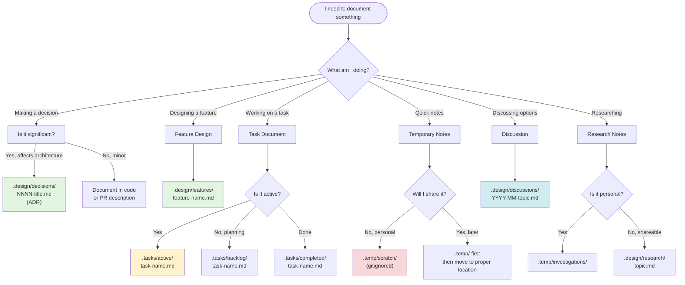
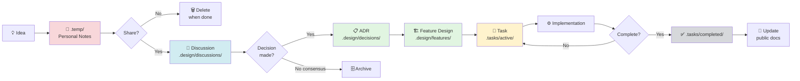
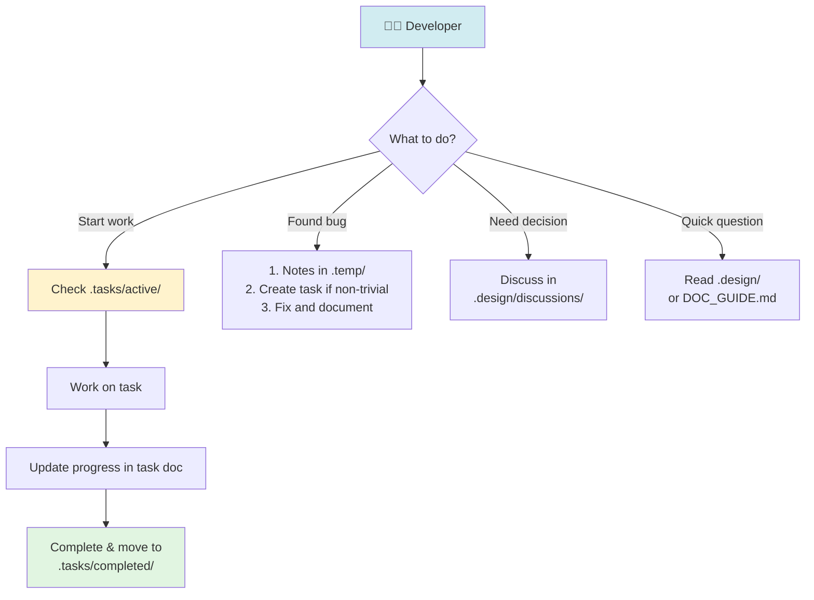
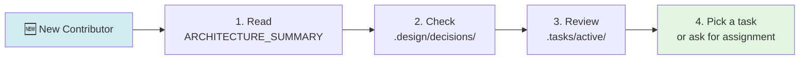
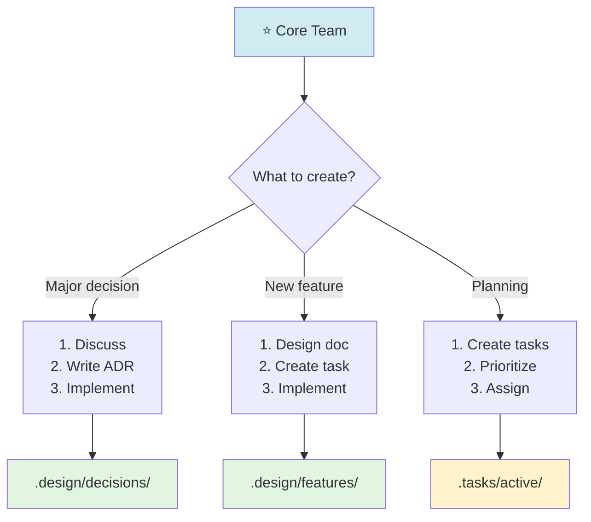
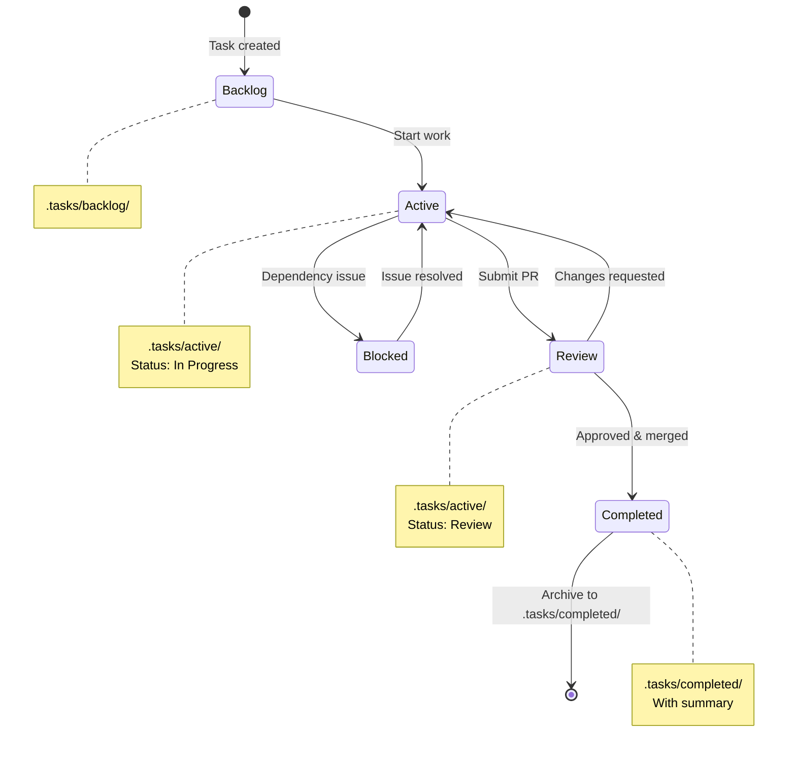
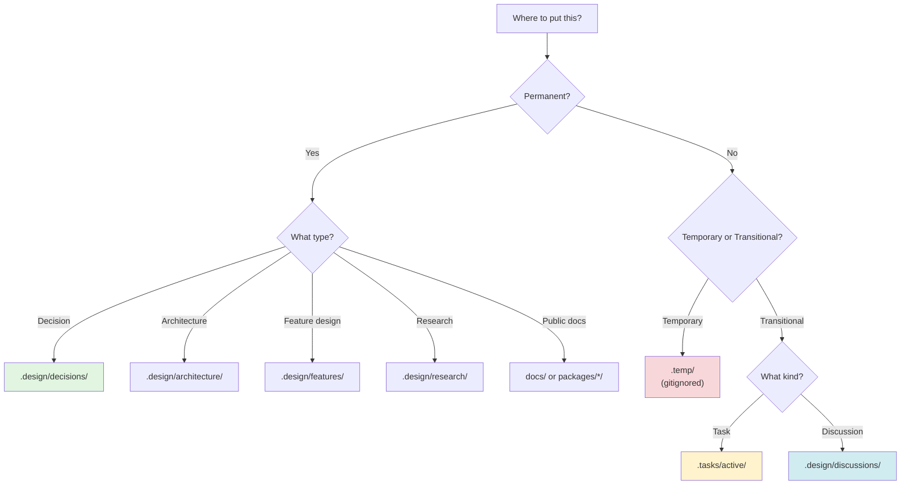
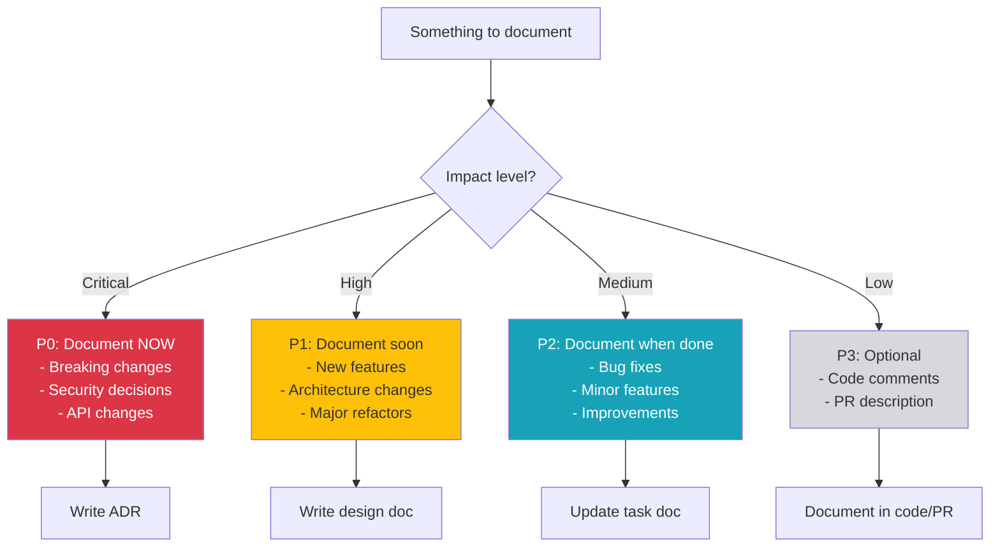

# Documentation Workflow & Decision Trees

Visual guides for navigating the SemaJSX documentation system.

---

## 🌳 Decision Tree: Where Should This Go?

---

## 📊 Document Lifecycle Flow

---

## 🎭 Role-Based Navigation

### For Developers

### For Contributors (New)

### For Core Team

---

## 🔄 Task Status Transitions

---

## 📁 Directory Structure Decision

---

## 🎯 Quick Reference Matrix

| Scenario                                    | Location                                  | Lifespan       | Template                                                                     |
| ------------------------------------------- | ----------------------------------------- | -------------- | ---------------------------------------------------------------------------- |
| 💡 **Significant architectural decision**   | `.design/decisions/`                      | Permanent      | [ADR Template](../DOCUMENTATION_PLAN.md#1-architectural-decision-record-adr) |
| 🏗️ **Feature design before implementation** | `.design/features/`                       | Permanent      | [Feature Template](../DOCUMENTATION_PLAN.md#2-feature-design-document)       |
| 📋 **Active work tracking**                 | `.tasks/active/`                          | Until done     | [Task Template](../../.tasks/templates/feature-task.md)                      |
| 💬 **Design discussion/proposal**           | `.design/discussions/`                    | Until resolved | [Discussion Template](../DOCUMENTATION_PLAN.md#4-discussion-document)        |
| 🔍 **Research findings (shareable)**        | `.design/research/`                       | Reference      | Markdown                                                                     |
| 📝 **Personal notes/investigation**         | `.temp/investigations/`                   | Hours/days     | Freeform                                                                     |
| ✏️ **Quick scratch work**                   | `.temp/scratch/`                          | Hours          | Freeform                                                                     |
| 🗄️ **Completed work**                       | `.tasks/completed/` or `.design/archive/` | Historical     | N/A                                                                          |

---

## 🚦 Priority Guide for Documentation

---

## 💡 Tips for Navigation

### 1. Start with DOC_GUIDE.md

- One-page overview
- Decision tree
- Quick commands

### 2. Use Directory READMEs

- Each directory has its own guide
- Specific instructions for that area
- Templates and examples

### 3. Follow the Flow

- Idea → .temp/ → Discussion → ADR → Design → Task → Done
- Not all steps required
- Skip if not needed

### 4. When in Doubt

- Start in `.temp/` (personal, gitignored)
- Graduate to proper location when ready
- Ask in discussions if unsure

---

**See Also**:

- [DOC_GUIDE.md](../../DOC_GUIDE.md) - Quick reference
- [DOCUMENTATION_PLAN.md](../DOCUMENTATION_PLAN.md) - Full strategy
- [ARCHITECTURE_SUMMARY.md](../ARCHITECTURE_SUMMARY.md) - System overview

**Last Updated**: 2026-01-08
