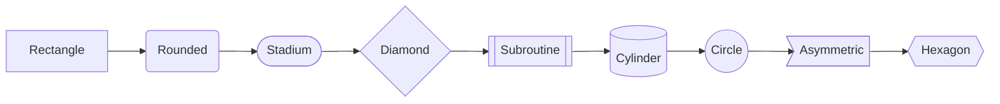
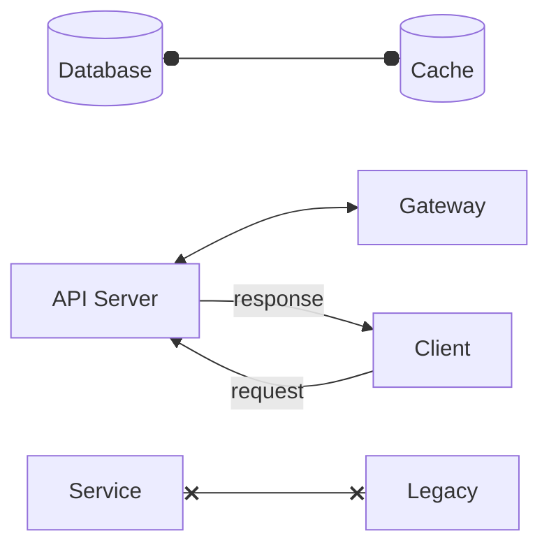
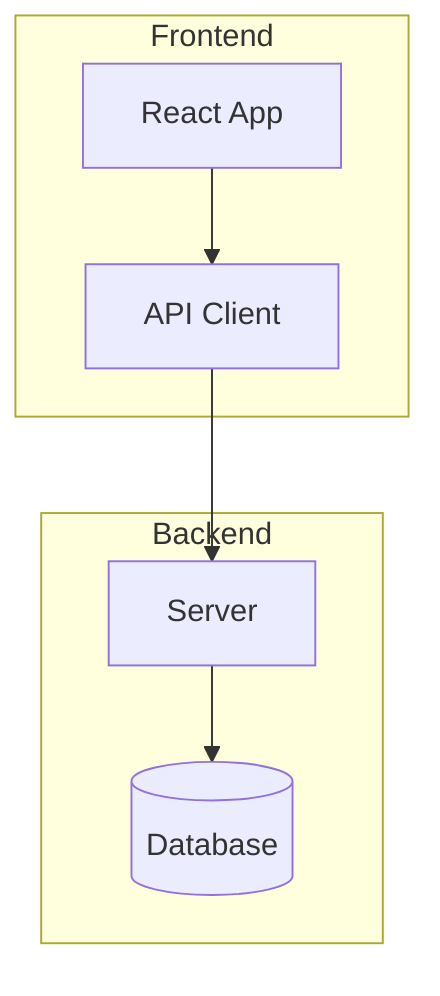
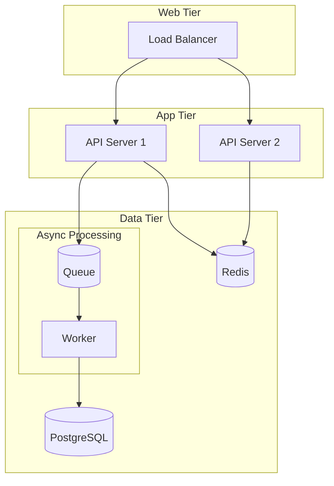
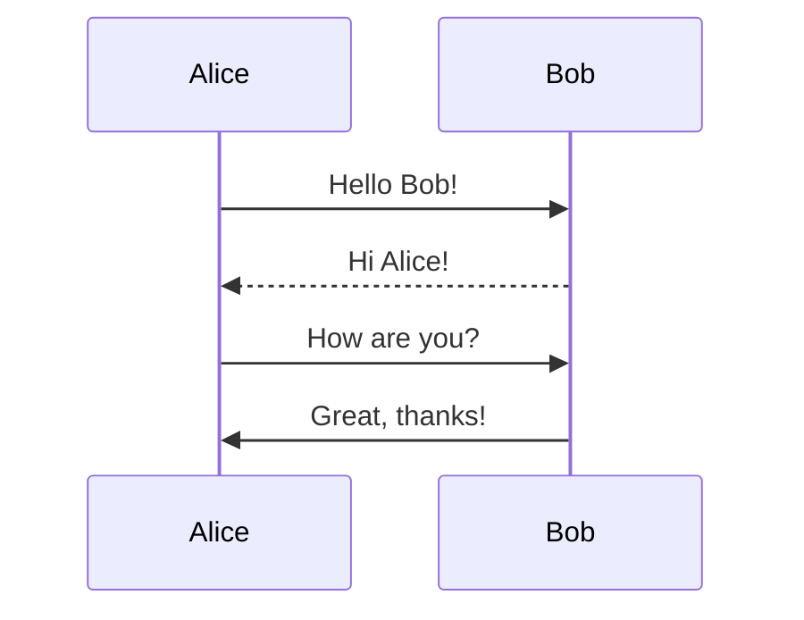
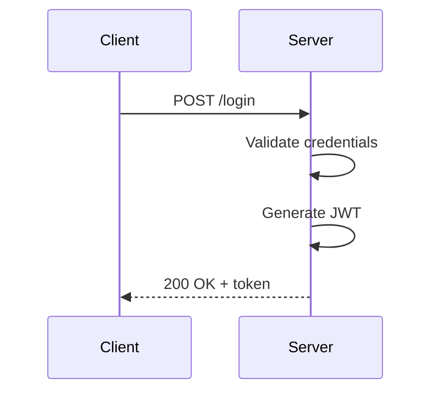
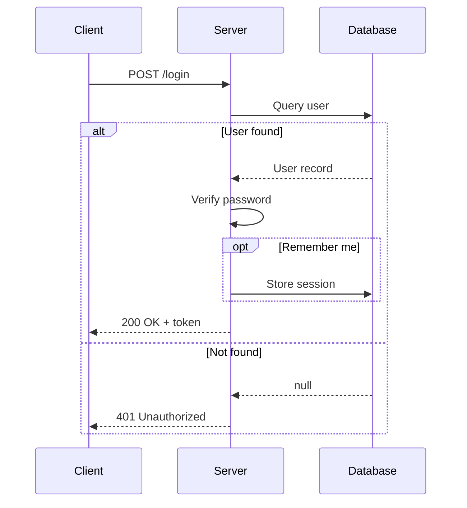
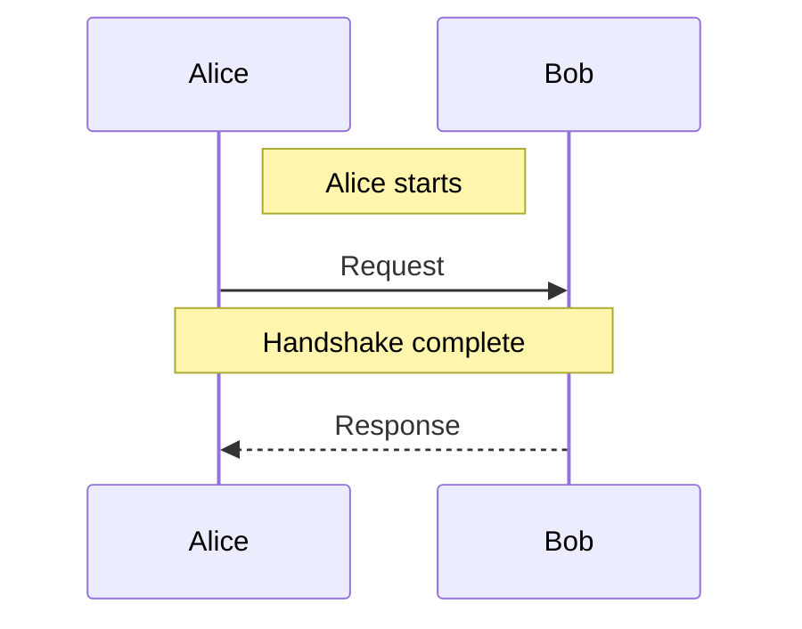

# Mermaid Diagrams

`semajsx/mermaid` renders Mermaid diagram syntax as reactive SVG components. It supports flowcharts and sequence diagrams with full theming, custom renderers, and signal-driven reactivity.

## Installation

```bash
bun add semajsx
```

## Quick Start

Pass a Mermaid code string to the `<Mermaid>` component:

```tsx
/** @jsxImportSource semajsx/dom */

import { render } from "semajsx/dom";
import { Mermaid } from "semajsx/mermaid";

const code = `graph TD
  A[Start] --> B{Decision}
  B -->|Yes| C[OK]
  B -->|No| D[Cancel]
`;

render(<Mermaid code={code} />, document.getElementById("app"));
```

The component parses the DSL, computes layout, and renders an `<svg>` element.

## Flowcharts

### Directions

Use `graph` or `flowchart` followed by a direction keyword:

| Keyword     | Direction     |
| ----------- | ------------- |
| `TD` / `TB` | Top to bottom |
| `BT`        | Bottom to top |
| `LR`        | Left to right |
| `RL`        | Right to left |

### Node Shapes




### Edge Syntax

Edges connect nodes with different line styles and endpoint markers:

| Syntax  | Line   | Source | Target | Description              |
| ------- | ------ | ------ | ------ | ------------------------ |
| `-->`   | solid  | none   | arrow  | Standard directed edge   |
| `---`   | solid  | none   | none   | Open connection          |
| `-.->`  | dotted | none   | arrow  | Dotted directed edge     |
| `-.-`   | dotted | none   | none   | Dotted open edge         |
| `==>`   | thick  | none   | arrow  | Thick directed edge      |
| `===`   | thick  | none   | none   | Thick open edge          |
| `<-->`  | solid  | arrow  | arrow  | Bidirectional            |
| `--o`   | solid  | none   | dot    | Dot endpoint             |
| `--x`   | solid  | none   | cross  | Cross endpoint           |
| `o--o`  | solid  | dot    | dot    | Dot on both ends         |
| `x--x`  | solid  | cross  | cross  | Cross on both ends       |
| `o-->`  | solid  | dot    | arrow  | Dot source, arrow target |
| `<-.->` | dotted | arrow  | arrow  | Dotted bidirectional     |
| `-.-o`  | dotted | none   | dot    | Dotted dot endpoint      |
| `-.-x`  | dotted | none   | cross  | Dotted cross endpoint    |
| `o-.-o` | dotted | dot    | dot    | Dotted dot both ends     |
| `<==>`  | thick  | arrow  | arrow  | Thick bidirectional      |
| `==o`   | thick  | none   | dot    | Thick dot endpoint       |
| `==x`   | thick  | none   | cross  | Thick cross endpoint     |

Add labels with `\|text\|` after the arrow: `A -->|label| B`

### Dual-End Markers

Edges support independent source and target markers. Use this to express relationships like composition, aggregation, or bidirectional data flow:




### Subgraphs

Group related nodes:




### Nested Subgraphs

Subgraphs can be nested to represent hierarchical grouping. The layout engine automatically adds extra spacing between layers so that nested bounding boxes don't overlap:




## Sequence Diagrams

### Basic Syntax




### Arrow Types

| Syntax | Style                  | Description           |
| ------ | ---------------------- | --------------------- |
| `->>`  | solid with arrowhead   | Synchronous message   |
| `-->>` | dotted with arrowhead  | Reply / async         |
| `-x`   | solid with cross       | Lost message          |
| `--x`  | dotted with cross      | Lost async message    |
| `-)`   | solid with open arrow  | Async fire-and-forget |
| `--)`  | dotted with open arrow | Async reply           |

### Self-Messages

A participant can send a message to itself. The layout renders these as a loopback arrow with extra vertical space:




### Control Flow Blocks

Use `loop`, `alt`/`else`, `opt`, `par`/`and`, `critical`, and `break`:




### Notes

Attach notes to participants:




## Programmatic Usage

Build diagrams from IR objects instead of DSL strings:

```tsx
/** @jsxImportSource semajsx/dom */

import { render } from "semajsx/dom";
import { Flowchart } from "semajsx/mermaid";
import type { FlowchartDiagram } from "semajsx/mermaid";

const diagram: FlowchartDiagram = {
  type: "flowchart",
  direction: "TD",
  nodes: [
    { id: "a", label: "Start", shape: "stadium" },
    { id: "b", label: "Process", shape: "rect" },
    { id: "c", label: "End", shape: "circle" },
  ],
  edges: [
    { source: "a", target: "b", lineStyle: "solid", sourceMarker: "none", targetMarker: "arrow" },
    { source: "b", target: "c", lineStyle: "dotted", sourceMarker: "dot", targetMarker: "arrow" },
  ],
  subgraphs: [],
};

render(<Flowchart diagram={diagram} />, document.getElementById("app"));
```

<Callout type="tip" title="Signal-driven diagrams">
Both `<Mermaid code={codeSignal}>` and `<Flowchart diagram={diagramSignal}>` accept signals. When the signal value changes, the diagram re-renders reactively.
</Callout>

## Parsing

Parse Mermaid DSL to the IR without rendering:

```tsx
import { parse, parseFlowchart, parseSequence } from "semajsx/mermaid";

// Auto-detect diagram type
const result = parse("graph TD\n  A --> B");
if (result.type === "flowchart") {
  console.log(result.nodes); // [{ id: "A", ... }, { id: "B", ... }]
  console.log(result.edges); // [{ source: "A", target: "B", lineStyle: "solid", ... }]
}

// Type-specific parsers
const flowchart = parseFlowchart("graph LR\n  X o-->|data| Y");
const sequence = parseSequence("sequenceDiagram\n  A->>B: Hi");
```

## Theming

Switch between built-in themes or provide custom tokens:

```tsx
/** @jsxImportSource semajsx/dom */

import { Mermaid, MermaidProvider, darkTheme } from "semajsx/mermaid";

function App() {
  return (
    <MermaidProvider theme={darkTheme}>
      <Mermaid code={`graph TD\n  A --> B`} />
    </MermaidProvider>
  );
}
```

## Custom Renderers

Override how specific elements are rendered:

```tsx
/** @jsxImportSource semajsx/dom */

import { Mermaid, defaultRenderers } from "semajsx/mermaid";
import type { NodeRenderProps } from "semajsx/mermaid";

function DiamondNode(props: NodeRenderProps) {
  return (
    <g transform={`translate(${props.x}, ${props.y})`}>
      <polygon
        points={`0,${-props.height / 2} ${props.width / 2},0 0,${props.height / 2} ${-props.width / 2},0`}
        class={props.class}
      />
      <text text-anchor="middle" dy="0.35em">
        {props.label}
      </text>
    </g>
  );
}

const renderers = {
  ...defaultRenderers,
  "node:rhombus": DiamondNode,
};

render(<Mermaid code={code} renderers={renderers} />, document.getElementById("app"));
```

## Layout Options

Customize the layout engine by passing options to the `<Flowchart>` or `<Sequence>` component, or through `flowchartLayout()` / `sequenceLayout()` directly:

```tsx
import { flowchartLayout } from "semajsx/mermaid";

const layout = flowchartLayout(diagram, {
  edgeRouting: "orthogonal", // "bezier" | "polyline" | "orthogonal"
  nodeSpacing: 60, // horizontal gap between nodes in the same layer
  rankSpacing: 80, // vertical gap between layers
  nodeWidth: 150, // default node width
  nodeHeight: 50, // default node height
  nodePadding: 16, // padding inside subgraph boxes
  diagramPadding: 20, // padding around the entire diagram
});
```

### Edge Routing Modes

| Mode         | Description                                                |
| ------------ | ---------------------------------------------------------- |
| `bezier`     | Smooth cubic bezier curves (default)                       |
| `polyline`   | Straight diagonal lines                                    |
| `orthogonal` | Manhattan-style routing — horizontal and vertical segments |

Orthogonal routing works well for architecture diagrams where clean right-angle connectors improve readability.

## MDX Integration

The `remarkMermaid` plugin transforms fenced ` ```mermaid ` code blocks into rendered `<Mermaid>` components inside MDX files:

```tsx
import { remarkMermaid } from "semajsx/mermaid/remark";

// In your MDX / SSG config:
mdx: {
  remarkPlugins: [remarkMermaid],
  components: { Mermaid },
}
```

With this plugin enabled, writing a mermaid code fence in your markdown automatically renders a live diagram.

### Showing Raw Mermaid Code

To display mermaid source code as a literal code block (without rendering it as a diagram), add the `raw` meta flag:

````md

````

This is useful for documentation that needs to show both the syntax and the rendered output side by side.

## Next Steps

- Learn about [Styling](/reference/styling) for CSS integration
- Explore [Signals](/reference/signals) for reactive diagram updates
- Check out [SSR](/reference/ssr) for server-rendered diagrams
