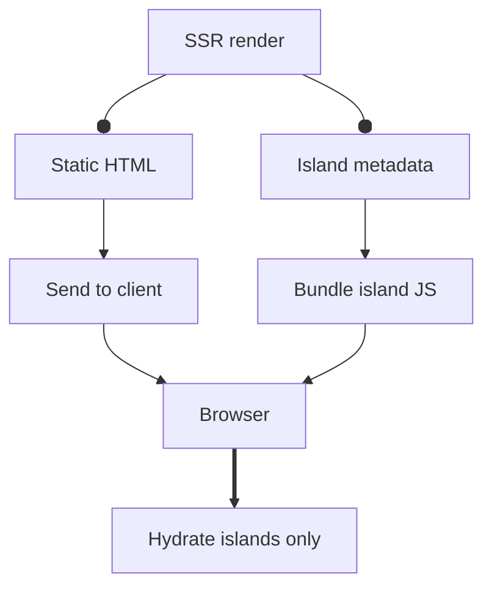

# Server-Side Rendering

`semajsx/ssr` provides server-side rendering with an island architecture — static HTML with selectively hydrated interactive components.

## Quick Start

Create an SSR application with `createApp`:

```tsx
import { createApp } from "semajsx/ssr";

const app = createApp({
  rootDir: import.meta.dir,
});

// Define routes
app.route("/", async (ctx) => {
  return (
    <html>
      <body>
        <h1>Hello from the server!</h1>
      </body>
    </html>
  );
});

// Start dev server
await app.dev({ port: 3000 });
```

## `renderToString`

Render a VNode tree to an HTML string:

```tsx
import { renderToString } from "semajsx/ssr";

const result = await renderToString(<App />);

console.log(result.html); // HTML string
console.log(result.islands); // Island metadata
console.log(result.css); // Collected CSS
```

## Island Architecture




Mark interactive components as islands. They render as static HTML on the server and hydrate on the client:

```tsx
/** @jsxImportSource semajsx/dom */

import { signal } from "semajsx/signal";

// This component becomes an island
function Counter() {
  const count = signal(0);

  return (
    <div>
      <p>Count: {count}</p>
      <button onClick={() => count.value++}>+1</button>
    </div>
  );
}
```

The server renders the initial HTML. The client-side JavaScript only loads for island components, keeping the page fast.

## Routes

Define routes with handlers:

```tsx
const app = createApp({ rootDir: import.meta.dir });

// Static route
app.route("/about", async () => {
  return <AboutPage />;
});

// Dynamic route
app.route("/blog/:slug", async (ctx) => {
  const post = await getPost(ctx.params.slug);
  return <BlogPost post={post} />;
});

// Multiple routes at once
app.routes({
  "/": () => <HomePage />,
  "/contact": () => <ContactPage />,
});
```

## Building for Production

Build static or server-rendered output:

```tsx
const app = createApp({ rootDir: import.meta.dir });

// ... define routes

// Build for production
const result = await app.build({
  outDir: "./dist",
});

console.log(`Built ${result.pages} pages`);
```

## Development Server

Start a dev server with hot reload:

```tsx
await app.dev({
  port: 3000,
  open: true,
});
```

## SSR + Styling

Styles from `semajsx/style` are automatically collected during SSR:

```tsx
import { renderToString } from "semajsx/ssr";

const { html, css } = await renderToString(<App />);

const page = `
<!DOCTYPE html>
<html>
<head><style>${css}</style></head>
<body>${html}</body>
</html>
`;
```

<Callout type="tip" title="Island hydration">
When the client hydrates islands, existing styles in the DOM are detected and not re-injected.
</Callout>

## Next Steps

- Learn about [SSG](/reference/ssg) for fully static sites
- Explore the [Component API](/reference/components) for building reusable components
- Check out [DOM Rendering](/reference/dom-rendering) for client-side details
